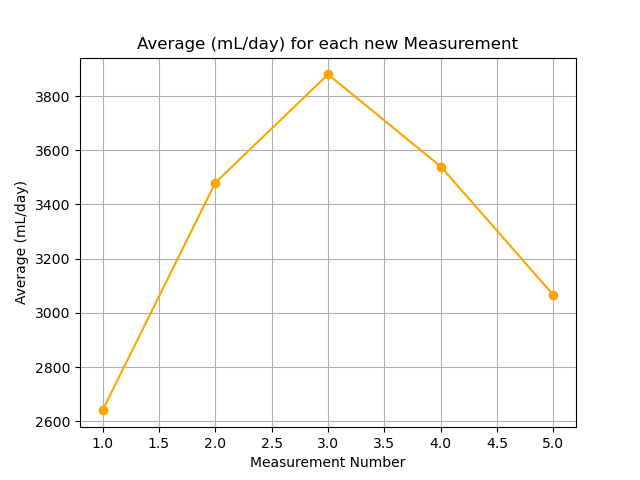
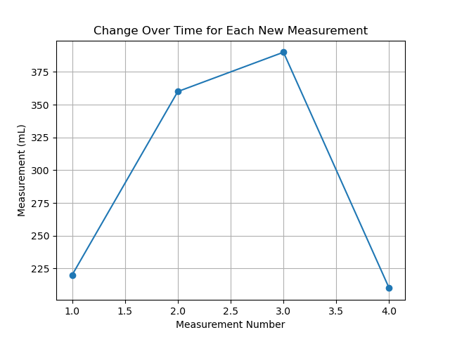

# Heater Plots

My water heater is leaking, so I made this because I'm lazy.

---

## Plots

### Line of best fit - Accurate average.

### Plot of Weak average.

### Plot of the Raw data

---

## Results

| Number | Date | Time (t_0) | Time (t_final) | Time (diff) | Measurement (mL) | mL/h | Average (mL/h) | mL/day | Average (mL/day) | Average (Average (mL/h) over 24 hours) |
| --- | --- | --- | --- | --- | --- | --- | --- | --- | --- | --- |
| 1 | 2023-04-24 | 14:39 | 16:39 | 2.0 | 220 | 110.0 | 110.0 | 2640.0 | 2640.0 | 2640.0 |
| 2 | 2023-04-24 | 16:45 | 18:45 | 2.0 | 360 | 180.0 | 145.0 | 4320.0 | 3480.0 | 3060.0 |
| 3 | 2023-04-24 | 18:51 | 20:51 | 2.0 | 390 | 195.0 | 161.66666666666666 | 4680.0 | 3880.0 | 3333.333333333333 |
| 4 | 2023-04-24 | 20:52 | 22:52 | 2.0 | 210 | 105.0 | 147.5 | 2520.0 | 3540.0 | 3385.0 |
| 5 | 2023-04-24 | 23:00 | 01:00 | 2.0 | 300 | 150.0 | 148.0 | 3600.0 | 3552.0 | 3418.4 |

---