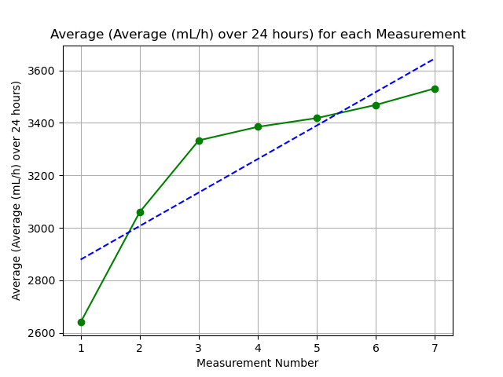

# Heater Plots

My water heater is leaking, so I made this because I'm lazy.

---

## Plots

### Line of best fit - Accurate average.

### Plot of Weak average.

### Plot of the Raw data

---

## Results

| Number | Date | Time (t_0) | Time (t_final) | Time (diff) | Measurement (mL) | mL/h | Average (mL/h) | mL/day | Average (mL/day) | Average (Average (mL/h) over 24 hours) |
| --- | --- | --- | --- | --- | --- | --- | --- | --- | --- | --- |
| 1 | 2023-04-24 | 1439 | 1639 | 2.0 | 220 | 110.0 | 110.0 | 2640.0 | 2640.0 | 2640.0 |
| 2 | 2023-04-24 | 1645 | 1845 | 2.0 | 360 | 180.0 | 145.0 | 4320.0 | 3480.0 | 3060.0 |
| 3 | 2023-04-24 | 1851 | 2051 | 2.0 | 390 | 195.0 | 161.66666666666666 | 4680.0 | 3880.0 | 3333.333333333333 |
| 4 | 2023-04-24 | 2052 | 2252 | 2.0 | 210 | 105.0 | 147.5 | 2520.0 | 3540.0 | 3385.0 |
| 5 | 2023-04-24 | 2255 | 55 | 6.166666666666667 | 300 | 48.648648648648646 | 127.72972972972973 | 1167.5675675675675 | 3065.5135135135133 | 3321.1027027027026 |

---